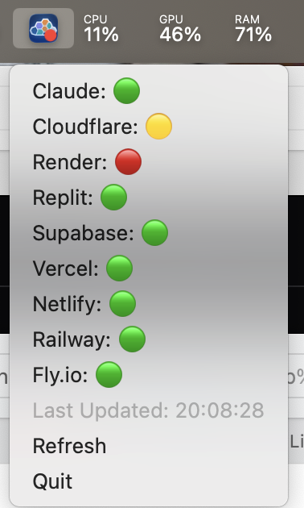

<div align="center">
  
  <h1>StatusRelay</h1>
  <p><strong>A sleek, deeply integrated macOS and Windows tray application to monitor Atlassian Statuspage services.</strong></p>
</div>

<br/>



## Overview

StatusRelay is a native macOS and Windows system tray application that monitors external infrastructure health (e.g., Claude, Cloudflare). It runs quietly in the background (hiding the dock/taskbar icon), minimizing CPU footprint and allowing you to check real-time service health with zero friction.

## 📥 Download

You can download the latest pre-compiled binaries for **macOS (.dmg / .app)** and **Windows (.msi / .exe)** from the [Releases](https://github.com/neisii/status-relay/releases) page.

Features include:
- **Dynamic Tray Badges:** Overlays a clean native color dot (🟢 Operational, 🟡 Degraded, 🔴 Outage) right over the app logo on your system tray/menu bar.
- **Native Notifications:** Triggers native OS notification alerts instantly when a service degrades or recovers.
- **Ultra-lightweight:** Powered by **Tauri v2** + **Rust** (`tokio` async). Zero heavy UI components.

---

## 🚀 Getting Started

### Prerequisites
Make sure you have [Node.js](https://nodejs.org/) and [Rust](https://www.rust-lang.org/) installed.

### Setup

1. **Install dependencies:**
```bash
npm install
```

2. **Run in development mode:**
```bash
npm run tauri dev
```
> **Note:** Because this app runs strictly in `Accessory` mode, it will **not** open a standard window or show in your Dock. Look toward your macOS top-right menu bar to interact with it!

3. **Build the Standalone Application:**
```bash
npm run tauri build
```
Once the process finishes, you can find the highly optimized compiled application at:
- **macOS:** `src-tauri/target/release/bundle/macos/StatusRelay.app`
- **Windows:** `src-tauri/target/release/bundle/msi/*.msi`

---

## Technical Stack
- **Rust backend**: Handles the HTTP polling via `reqwest` and state diff calculation.
- **Async Runtime**: `tokio` for decoupled background sleeps and HTTP concurrency.
- **Tauri Ecosystem**: Handles the cross-platform Tray construction and native APIs (`tauri-plugin-notification`).

## Architecture Highlights
The core of this system intercepts Atlassian `v2/status.json` payloads, parses them generically, caches state changes inside a `tokio::sync::Mutex` wrapper, and procedurally overwrites RGBA variables on the window icon to natively embed dynamic macOS "badges". No heavy UI frameworks are loaded!
